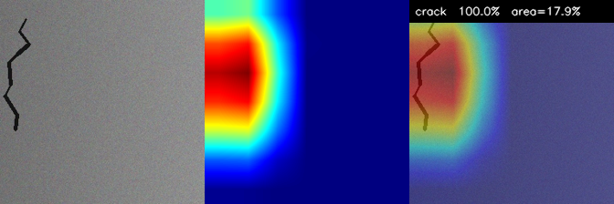
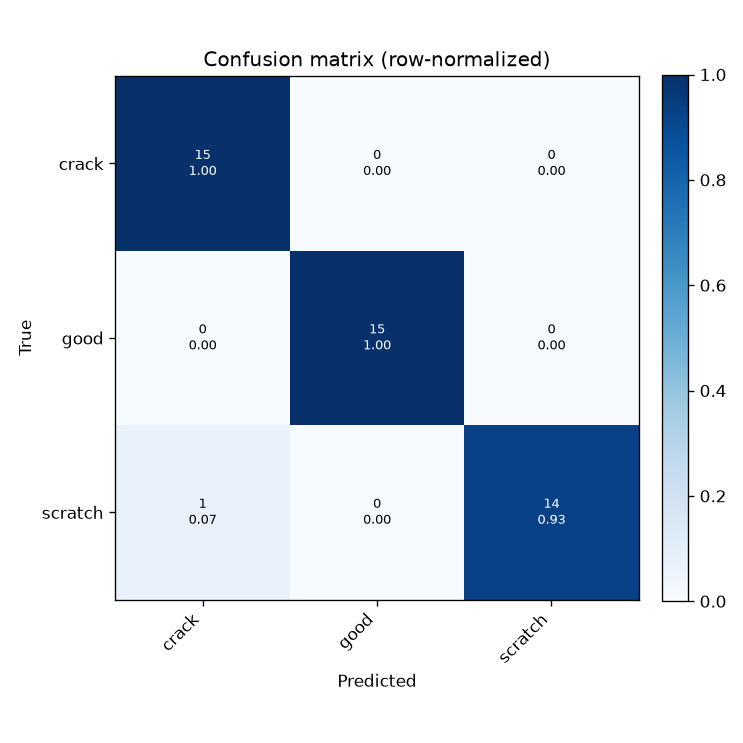

# Defect Inspection Digital Twin


A simulation-only inspection pipeline for **circular manufacturing**. The system
inspects a recovered end-of-life component, detects surface defects with computer
vision, grades the part with machine learning, and emits a recovery decision —
**REUSE / REPAIR / RECYCLE** — while a **digital twin** keeps a live virtual
record of every part it sees.

A personal project exploring how vision + ML can automate the *reuse / repair /
recycle* triage that sits at the heart of the circular economy. Everything runs
in **simulation — no physical hardware required.**

## Sample result (Stage 1)

Each inspected part yields a defect **class**, a Grad-CAM **localization heatmap**
(the "mask"), a **confidence**, and a **defect-area %** — visualized as a
three-panel overlay (`original | heatmap | overlay + label`):



The model localizes the fracture and labels it `crack 100.0% area=21.1%`. Below
is the row-normalized confusion matrix from a short training run:



---

## Why this project

When a worn or broken component is recovered at end-of-life, the single most
valuable decision is *what to do with it next*. Reuse it as-is? Repair it? Or
send it to material recycling? That triage decision is exactly what this project
automates:

```
   ┌─────────┐   image    ┌─────────────┐  defects   ┌──────────┐  decision  ┌──────────────┐
   │ Camera  │ ─────────► │ Inspection  │ ─────────► │ Grading  │ ─────────► │ Digital Twin │
   │ (sim)   │            │  CV + ML    │            │ decision │            │   record     │
   └─────────┘            └─────────────┘            └──────────┘            └──────────────┘
                          class+mask+conf       area% / type / severity     score+heatmap+ts
```

## Layered build plan

The repo is built in three independently-runnable stages. **Stage 1 is
implemented now**; Stages 2 and 3 are scaffolded and described so the project can
grow incrementally.

| Stage | What it adds | Stack | Status |
|------|---------------|-------|--------|
| **1** | PyTorch surface-defect model: defect **class + localization mask + confidence**, accuracy metrics, overlay visualizations. Trains on a free public dataset in Colab. | Python, PyTorch, OpenCV | ✅ Implemented |
| **2** | Grading + decision module (area% / type / count / severity → REUSE/REPAIR/RECYCLE + confidence) and a digital-twin data layer. Streamlit dashboard. | + Streamlit | 🔜 Scaffolded |
| **3** | ROS 2 (Humble) nodes — camera / inspection / decision / digital-twin — a minimal Gazebo inspection cell and an RViz config. | + ROS 2, Gazebo, RViz | 🔜 Scaffolded |

---

## Repo structure

```
defect-inspection-digital-twin/
├── README.md                  ← you are here
├── requirements.txt           ← Stage 1/2 Python deps
├── Dockerfile                 ← reproducible CPU/GPU environment
├── .gitignore
├── stage1_vision/             ← STAGE 1 (implemented)
│   ├── config.py              ← all paths / hyperparameters in one place
│   ├── dataset.py             ← dataset loader (ImageFolder-style, NEU/casting)
│   ├── model.py               ← lightweight pretrained backbone (ResNet18/MobileNet)
│   ├── train.py               ← fine-tuning loop + metrics + checkpoints
│   ├── inference.py           ← class + Grad-CAM mask + confidence + overlays
│   ├── gradcam.py             ← minimal dependency-free Grad-CAM
│   ├── utils.py               ← seeding, metrics, plotting helpers
│   └── README.md              ← Stage 1 quickstart
├── notebooks/
│   └── colab_stage1.ipynb     ← one-click Colab training/inference
├── data/                      ← datasets land here (git-ignored)
├── outputs/                   ← checkpoints, metrics, visualizations (git-ignored)
└── docs/
    └── SAMPLE_RESULTS.md      ← what each demo should show
```

---

## Quick start (Stage 1, local GPU)

```bash
# 1. Environment
python -m venv .venv && source .venv/bin/activate
pip install -r requirements.txt

# 2. Get a dataset (see stage1_vision/README.md for options).
#    Arrange it as ImageFolder:  data/<dataset>/<split>/<class>/*.jpg
#    A tiny synthetic dataset is generated automatically if none is found,
#    so you can smoke-test the whole pipeline with zero downloads:
python -m stage1_vision.dataset --make-synthetic

# 3. Train (fine-tune ResNet18, ~minutes on a mid-range GPU)
python -m stage1_vision.train --data data/synthetic --epochs 5

# 4. Inference + visual overlays on a folder of images
python -m stage1_vision.inference \
    --weights outputs/best_model.pt \
    --images data/synthetic/test \
    --out outputs/predictions
```

Outputs land in `outputs/`: `best_model.pt`, `metrics.json`,
`confusion_matrix.png`, and per-image overlay PNGs (original | defect heatmap |
overlay with predicted class + confidence).

## Run it in Google Colab (free GPU)

See **[stage1_vision/README.md](stage1_vision/README.md#colab)** for the full
walkthrough, or open `notebooks/colab_stage1.ipynb` directly in Colab.

---

## Datasets (all free, no paid services)

Stage 1 works with any **ImageFolder-style** classification dataset. Recommended
public surface-defect / anomaly datasets:

- **NEU-DET / NEU-CLS** — 6 hot-rolled steel surface defect classes (crazing,
  inclusion, patches, pitted, rolled-in scale, scratches). Small and fast.
- **Casting product defects** (Kaggle, `ravirajsinh45/...`) — binary `def_front`
  / `ok_front`. Great for a clean REUSE-vs-RECYCLE story.
- **MVTec AD** — anomaly detection with ground-truth masks (research use).

The loader expects:

```
data/<name>/
├── train/<class_a>/*.jpg
│         <class_b>/*.jpg
└── test/ <class_a>/*.jpg
          <class_b>/*.jpg
```

If no dataset is present, `--make-synthetic` generates labelled synthetic
"parts" with painted-on defects so every script runs end-to-end offline.

---

## Reproducibility

- Fixed seeds (`config.SEED`) across Python / NumPy / PyTorch.
- Pretrained backbones + fine-tuning → short training, deterministic-ish runs.
- No paid services, no API keys, CPU-fallback everywhere.
- `Dockerfile` pins the environment.

See `docs/SAMPLE_RESULTS.md` for what a successful demo looks like.
