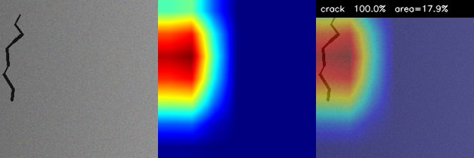
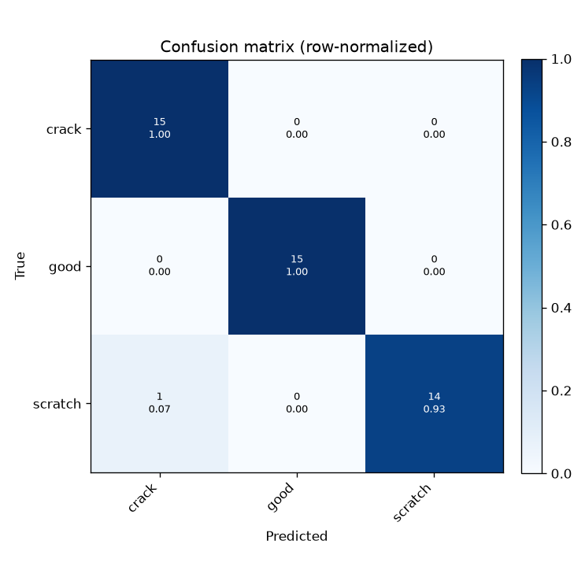

# Defect Inspection Digital Twin

A simulation-only inspection pipeline for **Digital manufacturing**. The system
inspects a recovered end-of-life component, detects surface defects with a computer
vision, grades the part with machine learning, and emits a structured **recovery
decision** — while a **digital twin** keeps a live virtual record of every part
it sees.

A personal project exploring how vision + ML can automate the triage decisions
that sit at the heart of the circular economy. 
---

## Sample result (Stage 1)

Each inspected part yields a defect **class**, a Grad-CAM **localization heatmap**
(the "mask"), a **confidence**, and a **defect-area %** — visualized as a
three-panel overlay (`original | heatmap | overlay + label`):

The model localizes the fracture and labels it `crack 100.0% area=21.1%`. Below
is the row-normalized confusion matrix from a short training run:

> [!WARNING]
> **Read that 100% as a warning sign, not a result.** It comes from the bundled synthetic
> dataset (`python -m stage1_vision.dataset --make-synthetic`), which exists so the pipeline
> runs offline with zero downloads. Synthetic defects are separable in a way real ones are
> not, and a saturated confidence is what that looks like. These numbers say the plumbing
> works; they say nothing about detection quality.

---

## Where this sits against the state of the art

Surface-defect detection is the most worked-over task in industrial computer vision, and the
usual benchmarks are close to saturated: leading methods reach around **99% image-level AUROC
on MVTec AD**, with segmentation AU-PRO clustered in the 92–97% band. MVTec published
[**MVTec AD 2**](https://www.mvtec.com/research-teaching/datasets/mvtec-ad-2) precisely
because differences under one percentage point had stopped being meaningful.

So a ResNet-plus-Grad-CAM classifier is a **baseline**, not a contribution, and this repository
does not pretend otherwise. What it is actually for is the layer above the model: turning a
per-image defect call into a *recovery decision* with a confidence and a live per-part record.
Benchmarked properly it would need to run on MVTec AD 2 or VisA and report against a strong
baseline such as PatchCore — that comparison is not here yet.

## Why this project

When a worn or broken component is recovered at end-of-life, the single most
valuable decision is *what to do with it next*: keep it as-is, send it for
restoration, or route it to material recovery? That triage decision is exactly
what this project automates:
